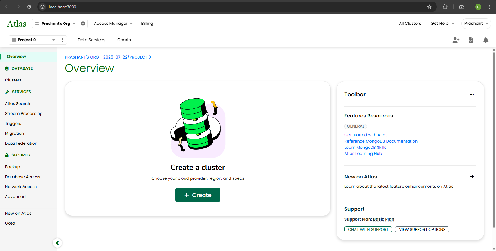
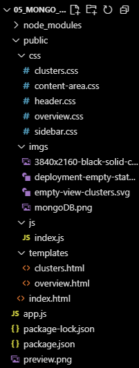

# MongoDB Web UI Clone 🌐

A **static clone** of the official MongoDB web interface built using **HTML, CSS, and JavaScript**.  
This project replicates the look and feel of MongoDB's UI, focusing on frontend design and responsiveness.  
It does not contain any backend functionality or database integration — purely a **UI/UX practice project**.

---

## 🚀 Project Objective
The goal of this project was to practice **frontend development skills** by cloning a real-world application interface.  
Through this, I explored:
- Structuring layouts with **HTML5**
- Styling with modern **CSS3** (Flexbox, Grid, Transitions)
- Adding interactivity with **JavaScript**
- Basic SPA (Single Page Application) Framework
- Building a **responsive UI** similar to production-grade apps

---

## 📸 Preview

🎥 **Demo Video**: [Project Walkthrough](link)  

---

## 🛠️ Tech Stack
- **HTML5** → For semantic structure  
- **CSS3** → For styling, responsive design, hover effects  
- **JavaScript** → For interactive elements  

---

## ✨ Features
- Fully responsive **navigation bar**  
- Styled UI components similar to MongoDB's design  
- Smooth hover effects and transitions  
- Organized layout for dashboard-like experience  
- Purely frontend (no database / backend)  

---

## 📂 Project Structure

---

## NOTE:
- In nav bar, only "Overview" and "Clusters" buttons are working.
- This UI needs some IMPROVEMENTS.

---

## 👨‍💻 Author
**Prashant Mistri**
- Threads: [codingweapon](https://www.threads.com/codingweapon)
- Instagram: [codingweapon](https://www.instagram.com/codingweapon)
- Youtube: [codingweapon](https://www.youtube.com/@realcodingweapon)
- GitHub: [prashant348](https://www.github.com/prashant348)

---

### 🖤 Made with love by CodingWeapon

